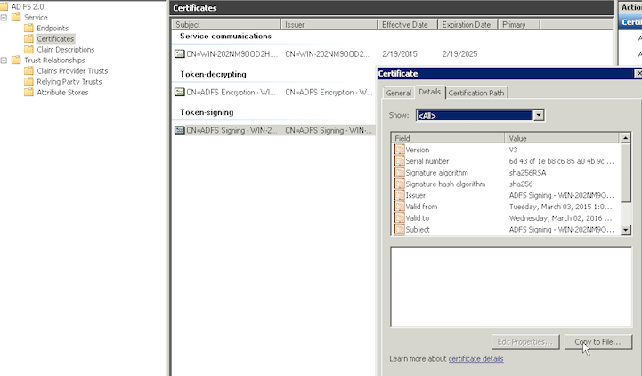
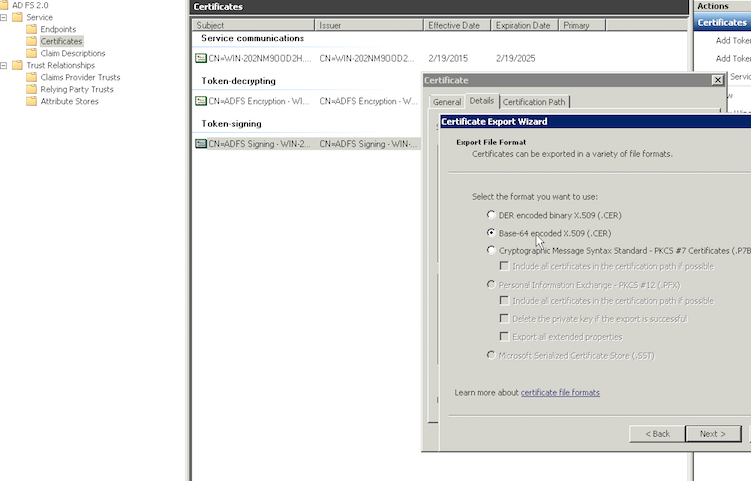

# ADFS administrator guide

This guide will step you through the configuration steps needed to integrate with a SilverStripe site by getting ADFS to act as a SAML Identity Provider (IdP).

As an ADFS administrator, after reading this guide, you should be able to provide federated authentication service to a SilverStripe site using *silverstripe-activedirectory* module.

## Table of contents

<!-- START doctoc generated TOC please keep comment here to allow auto update -->
<!-- DON'T EDIT THIS SECTION, INSTEAD RE-RUN doctoc TO UPDATE -->

- [Overview](#overview)
- [Make IdP certificate available](#make-idp-certificate-available)
- [Create a new relying party trust](#create-a-new-relying-party-trust)
  - [Select Data Source](#select-data-source)
  - [Specify Display Name](#specify-display-name)
- [Setup claim rules](#setup-claim-rules)
  - [Rule 1: Send LDAP Attributes](#rule-1-send-ldap-attributes)
  - [Rule 2: Send objectId as nameidentifier](#rule-2-send-objectid-as-nameidentifier)
- [Set the secure hash algorithm](#set-the-secure-hash-algorithm)

<!-- END doctoc generated TOC please keep comment here to allow auto update -->

## Overview

This is not an exhaustive guide, and it only covers one operating system (Windows Server 2008 R2) and one specific version of ADFS (2.0).

As an implementor of the IdP, you will need to ensure the following have been set up:

* Establishing bi-directional trust between SP and IdP
* Adding a claim rule to send LDAP attributes
* Adding a claim rule to use "objectId" as "nameidentifier"
* Ensuring compatible hash algorithm is used

If you are using a different version of AD or ADFS, this guide will hopefully give you enough context to do so.

## Make IdP certificate available

SilverStripe site needs the IdP certificate to be able to establish the trust relationship.

If you have access to the webserver, install the certificate at a known location and pass the path to the SilverStripe developer for configuration.

You can get the certificate by either parsing it out from the endpoint `https://<idp-domain>/FederationMetadata/2007-06/FederationMetadata.xml`
or by exporting the certificate manually using ADFS console on Windows.
In this documentation we're going to manually extract the certificate.

In the ADFS console, go to Services > Certificates and right click the "Token-signing" certificate.
Click the "Details" tab and click "Copy to file".

A wizard opens, click "Next" and then choose "Base-64 encoded X.509 (.CER)". Click "Next" and choose a place to export the certificate. Click "Next" to finish the process.

## Create a new relying party trust

We'll now set up the trust relationship between the SilverStripe site and the IdP.

Right click "Relying Party Trusts" and click "Add Relying Party Trust...". Click "Start" when the dialog appears.

### Select Data Source

Enter the SilverStripe site SAML metadata endpoint: `https://<sp-domain>/saml/metadata` and press "Next".

### Specify Display Name

Here you can add any notes, for example who would be the technical contact for the SP.

## Setup claim rules

Claim rules decide what fields are used for performing authentication, and what is provided to the Service Provider as a context.

Two claim rules are essential for *silverstripe-activedirectory* module to work. We will set these up now.

Right click the relying party and choose "Edit Claim Rules".

### Rule 1: Send LDAP Attributes

This rule makes arbitrary AD attributes available for SAML authentication. We surface such parameters as "mail" for use as SilverStripe's email, "givenName" and "sn" for identifying the person, and "objectGuid" as a unique identifier.

You could expand the list of fields provided, and the *silverstripe-activedirectory* module would be able to utilise these, but it's best to keep SAML payloads small. A better way to accomplish this is via LDAP integration - ask your SilverStripe developer to do that instead.

Note that the "privatepersonalidentifier" must be a unique identifier (we will rely on it in "Rule 2"). Here we use "objectGuid".

Click "Add Rule" and select "Send Claims Using a Custom Rule" from the dropdown. Add the following rule:

	c:[Type == "http://schemas.microsoft.com/ws/2008/06/identity/claims/windowsaccountname", Issuer == "AD AUTHORITY"] => issue(store = "Active Directory", types = ("http://schemas.xmlsoap.org/ws/2005/05/identity/claims/emailaddress", "http://schemas.xmlsoap.org/ws/2005/05/identity/claims/givenname", "http://schemas.xmlsoap.org/ws/2005/05/identity/claims/surname", "http://schemas.xmlsoap.org/ws/2005/05/identity/claims/privatepersonalidentifier"), query = ";mail,givenName,sn,objectGuid;{0}", param = c.Value);

### Rule 2: Send objectId as nameidentifier

This rule relies on the previous one. We need a unique identifier to perform the authentication, so we make use of the previously defined "privatepersonalidentifier".

Repeat the same "Add Rule" as done above and select "Send Claims Using a Custom Rule" from the dropdown to add this rule:

	c:[Type == "http://schemas.xmlsoap.org/ws/2005/05/identity/claims/privatepersonalidentifier"] => issue(Type = "http://schemas.xmlsoap.org/ws/2005/05/identity/claims/nameidentifier", Issuer = c.Issuer, OriginalIssuer = c.OriginalIssuer, Value = c.Value, ValueType = c.ValueType, Properties["http://schemas.xmlsoap.org/ws/2005/05/identity/claimproperties/format"] = "urn:oasis:names:tc:SAML:2.0:nameid-format:transient");

## Set the secure hash algorithm

By default ADFS uses SHA-256 for signing the requests, the Active Directory
module by default uses this hash algorithm, but can be changed to use the less
secure SHA-1. The only reason should be changed is for compatibility with the
setting used by the SilverStripe site. Here is how to change it:

1. Right click the relying party and choose properties.
2. Choose the "Advanced" tab and select the "SHA-1" option in the dropdown and press OK.

