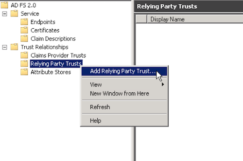
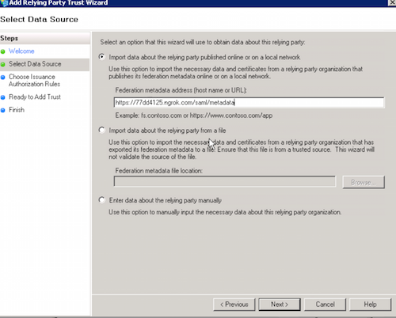
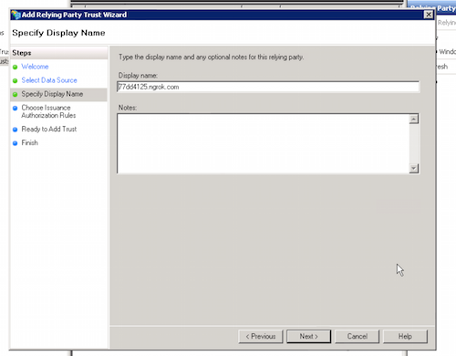
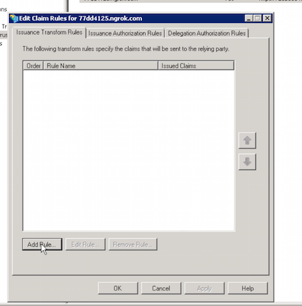
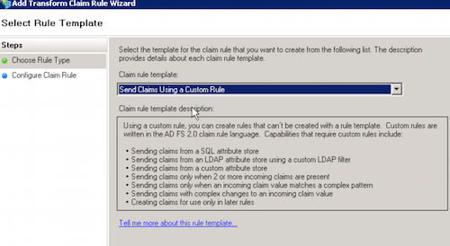
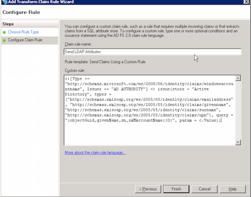
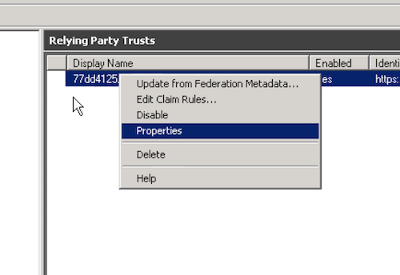
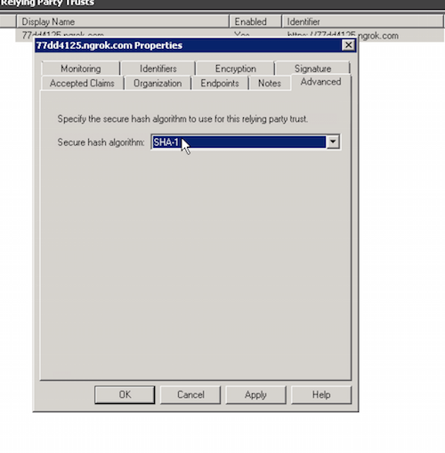

# AD FS 2.0 setup and configuration

## Install AD FS 2.0

This module is using AD FS 2.0 as an identity provider that issues SAML tokens for the identities it manages. 
For that, a new relying party needs to be created. A relying party in AD FS 2.0 is a representation of an 
application (a Web site or a Web service) and contains all the security-related information, such as 
encryption certificate, claims transformation rules and so on.

## Configuration of the Identity Provider (IdP)

### Open the AD FS Console

@todo add image where to find the console

### Create a new relying party trust

and click "Start"

### Select Data Source

"Federation metadata address (host name or URL):" should be the SilverStripe SAML metadata endpoint, e.g: 
"https://77dd4125.ngrok.com/saml/metadata".

### Specify Display Name

Here you can add any notes, for example who would be the technical contact for the SP.

### Choose Issuance Authorization Rules

@todo

## Setup claim rules

Claim rules decides what information is shared with the Service Provider. In this case the SP want to have 
a couple of properties from the Active Directory.

@todo image / doc on where to find the claims rule interface

Use the "Send Claims Using a Custom Rule" to setup the following rules.

5.1: Send LDAP Attributes

	c:[Type == "http://schemas.microsoft.com/ws/2008/06/identity/claims/windowsaccountname", Issuer == "AD AUTHORITY"] => issue(store = "Active Directory", types = ("http://schemas.xmlsoap.org/ws/2005/05/identity/claims/emailaddress", "http://schemas.xmlsoap.org/ws/2005/05/identity/claims/givenname", "http://schemas.xmlsoap.org/ws/2005/05/identity/claims/surname", "http://schemas.xmlsoap.org/ws/2005/05/identity/claims/upn"), query = ";mail,givenName,sn,objectGuid;{0}", param = c.Value);
	

5.2: Send objectId as nameidentifier

	c:[Type == "http://schemas.xmlsoap.org/ws/2005/05/identity/claims/upn"] => issue(Type = "http://schemas.xmlsoap.org/ws/2005/05/identity/claims/nameidentifier", Issuer = c.Issuer, OriginalIssuer = c.OriginalIssuer, Value = c.Value, ValueType = c.ValueType, Properties["http://schemas.xmlsoap.org/ws/2005/05/identity/claimproperties/format"] = "urn:oasis:names:tc:SAML:2.0:nameid-format:transient");

## Set the secure hash algorithm

You will also have to change the secure hash algorithm from SHA-256 to SHA-1

1. Right click the relying party and choose properties.
2. Choose the `Advanced` tab and select the `SHA-1` option in the dropdown and press OK.

